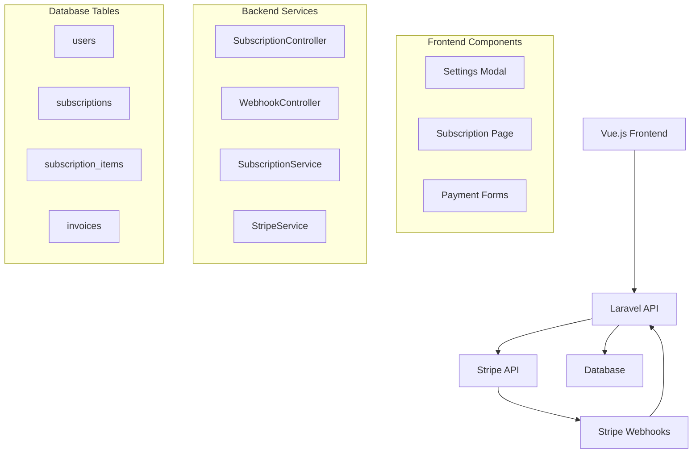

# Design Document

## Overview

This design implements Stripe payment integration for subscription management in the oposchat Laravel + Vue.js application. The solution will provide secure payment processing, subscription lifecycle management, and seamless integration with the existing settings modal interface. The architecture follows Laravel best practices and leverages Stripe's robust payment infrastructure.

## Architecture

### High-Level Architecture



### Technology Stack
- **Frontend**: Vue.js 3 with TypeScript, Inertia.js
- **Backend**: Laravel 12, PHP 8.2+
- **Payment Processing**: Stripe API v2024-12-18
- **Database**: MySQL/PostgreSQL with Laravel migrations
- **Authentication**: Laravel Sanctum (existing)

## Components and Interfaces

### Frontend Components

#### 1. Enhanced Subscription Settings
- **Location**: `resources/js/pages/settings/Subscription.vue`
- **Purpose**: Display current subscription status and upgrade options
- **Key Features**:
  - Current plan display with usage metrics
  - Pricing cards with Stripe Checkout integration
  - Subscription management portal access
  - Real-time status updates

#### 2. Stripe Checkout Integration
- **Location**: `resources/js/services/stripeService.js`
- **Purpose**: Handle Stripe Checkout sessions and payment flows
- **Key Features**:
  - Checkout session creation
  - Success/cancel handling
  - Error management
  - Loading states

#### 3. Settings Modal Enhancement
- **Location**: `resources/js/components/SettingsModal.vue` (existing)
- **Purpose**: Integrate subscription management into existing modal
- **Key Features**:
  - Subscription tab with real data
  - Payment method management
  - Billing history access

### Backend Components

#### 1. Subscription Controller
- **Location**: `app/Http/Controllers/SubscriptionController.php`
- **Purpose**: Handle subscription-related API endpoints
- **Methods**:
  - `index()` - Get user subscription status
  - `createCheckoutSession()` - Create Stripe checkout session
  - `manageSubscription()` - Redirect to customer portal
  - `cancelSubscription()` - Handle subscription cancellation

#### 2. Webhook Controller
- **Location**: `app/Http/Controllers/WebhookController.php`
- **Purpose**: Process Stripe webhook events
- **Methods**:
  - `handleWebhook()` - Main webhook handler
  - `handleSubscriptionCreated()` - Process new subscriptions
  - `handleSubscriptionUpdated()` - Process subscription changes
  - `handleInvoicePaid()` - Process successful payments

#### 3. Subscription Service
- **Location**: `app/Services/SubscriptionService.php`
- **Purpose**: Business logic for subscription management
- **Methods**:
  - `createSubscription()` - Create new subscription record
  - `updateSubscription()` - Update subscription status
  - `cancelSubscription()` - Handle cancellation logic
  - `syncWithStripe()` - Synchronize with Stripe data

#### 4. Stripe Service
- **Location**: `app/Services/StripeService.php`
- **Purpose**: Stripe API integration wrapper
- **Methods**:
  - `createCustomer()` - Create Stripe customer
  - `createCheckoutSession()` - Create checkout session
  - `retrieveSubscription()` - Get subscription from Stripe
  - `createPortalSession()` - Create customer portal session

## Data Models

### Database Schema

#### 1. Users Table Enhancement
```sql
ALTER TABLE users ADD COLUMN stripe_customer_id VARCHAR(255) NULL;
ALTER TABLE users ADD INDEX idx_stripe_customer_id (stripe_customer_id);
```

#### 2. Subscriptions Table
```sql
CREATE TABLE subscriptions (
    id BIGINT UNSIGNED AUTO_INCREMENT PRIMARY KEY,
    user_id BIGINT UNSIGNED NOT NULL,
    stripe_subscription_id VARCHAR(255) NOT NULL UNIQUE,
    stripe_customer_id VARCHAR(255) NOT NULL,
    stripe_price_id VARCHAR(255) NOT NULL,
    status VARCHAR(50) NOT NULL,
    current_period_start TIMESTAMP NULL,
    current_period_end TIMESTAMP NULL,
    trial_start TIMESTAMP NULL,
    trial_end TIMESTAMP NULL,
    cancel_at_period_end BOOLEAN DEFAULT FALSE,
    canceled_at TIMESTAMP NULL,
    created_at TIMESTAMP DEFAULT CURRENT_TIMESTAMP,
    updated_at TIMESTAMP DEFAULT CURRENT_TIMESTAMP ON UPDATE CURRENT_TIMESTAMP,
    
    FOREIGN KEY (user_id) REFERENCES users(id) ON DELETE CASCADE,
    INDEX idx_user_id (user_id),
    INDEX idx_stripe_subscription_id (stripe_subscription_id),
    INDEX idx_status (status)
);
```

#### 3. Subscription Items Table
```sql
CREATE TABLE subscription_items (
    id BIGINT UNSIGNED AUTO_INCREMENT PRIMARY KEY,
    subscription_id BIGINT UNSIGNED NOT NULL,
    stripe_subscription_item_id VARCHAR(255) NOT NULL UNIQUE,
    stripe_price_id VARCHAR(255) NOT NULL,
    quantity INTEGER NOT NULL DEFAULT 1,
    created_at TIMESTAMP DEFAULT CURRENT_TIMESTAMP,
    updated_at TIMESTAMP DEFAULT CURRENT_TIMESTAMP ON UPDATE CURRENT_TIMESTAMP,
    
    FOREIGN KEY (subscription_id) REFERENCES subscriptions(id) ON DELETE CASCADE,
    INDEX idx_subscription_id (subscription_id)
);
```

#### 4. Invoices Table
```sql
CREATE TABLE invoices (
    id BIGINT UNSIGNED AUTO_INCREMENT PRIMARY KEY,
    user_id BIGINT UNSIGNED NOT NULL,
    subscription_id BIGINT UNSIGNED NULL,
    stripe_invoice_id VARCHAR(255) NOT NULL UNIQUE,
    amount_paid INTEGER NOT NULL,
    currency VARCHAR(3) NOT NULL DEFAULT 'usd',
    status VARCHAR(50) NOT NULL,
    invoice_pdf VARCHAR(500) NULL,
    hosted_invoice_url VARCHAR(500) NULL,
    created_at TIMESTAMP DEFAULT CURRENT_TIMESTAMP,
    updated_at TIMESTAMP DEFAULT CURRENT_TIMESTAMP ON UPDATE CURRENT_TIMESTAMP,
    
    FOREIGN KEY (user_id) REFERENCES users(id) ON DELETE CASCADE,
    FOREIGN KEY (subscription_id) REFERENCES subscriptions(id) ON DELETE SET NULL,
    INDEX idx_user_id (user_id),
    INDEX idx_stripe_invoice_id (stripe_invoice_id)
);
```

### Eloquent Models

#### 1. Subscription Model
```php
class Subscription extends Model
{
    protected $fillable = [
        'user_id', 'stripe_subscription_id', 'stripe_customer_id',
        'stripe_price_id', 'status', 'current_period_start',
        'current_period_end', 'trial_start', 'trial_end',
        'cancel_at_period_end', 'canceled_at'
    ];

    protected $casts = [
        'current_period_start' => 'datetime',
        'current_period_end' => 'datetime',
        'trial_start' => 'datetime',
        'trial_end' => 'datetime',
        'canceled_at' => 'datetime',
        'cancel_at_period_end' => 'boolean'
    ];

    public function user(): BelongsTo
    public function items(): HasMany
    public function invoices(): HasMany
    public function isActive(): bool
    public function onTrial(): bool
    public function hasExpired(): bool
}
```

## Error Handling

### Frontend Error Handling
1. **Payment Failures**: Display user-friendly error messages for declined cards, insufficient funds, etc.
2. **Network Errors**: Implement retry logic and offline state handling
3. **Validation Errors**: Show field-specific validation messages
4. **Loading States**: Provide visual feedback during payment processing

### Backend Error Handling
1. **Stripe API Errors**: Catch and log Stripe exceptions, return appropriate HTTP responses
2. **Webhook Failures**: Implement retry logic and dead letter queues
3. **Database Errors**: Handle constraint violations and connection issues
4. **Authentication Errors**: Verify webhook signatures and API keys

### Error Response Format
```json
{
    "success": false,
    "message": "Payment processing failed",
    "error_code": "card_declined",
    "details": {
        "decline_code": "insufficient_funds",
        "user_message": "Your card was declined due to insufficient funds."
    }
}
```

## Testing Strategy

### Unit Tests
1. **Model Tests**: Test subscription status methods, relationships, and scopes
2. **Service Tests**: Test SubscriptionService and StripeService methods
3. **Controller Tests**: Test API endpoints with mocked Stripe responses

### Integration Tests
1. **Webhook Tests**: Test webhook processing with Stripe test events
2. **Payment Flow Tests**: Test complete subscription creation flow
3. **Database Tests**: Test data consistency and migrations

### Frontend Tests
1. **Component Tests**: Test subscription components with mocked API responses
2. **E2E Tests**: Test complete user subscription journey
3. **Payment Tests**: Test Stripe Elements integration

### Test Data Management
- Use Stripe test mode for all development and testing
- Create test fixtures for common subscription scenarios
- Mock Stripe API responses for unit tests
- Use database transactions for test isolation

## Security Considerations

### Payment Security
1. **PCI Compliance**: Use Stripe Elements to avoid handling card data
2. **Webhook Security**: Verify webhook signatures using Stripe's signing secret
3. **API Key Management**: Store Stripe keys in environment variables
4. **HTTPS Only**: Enforce HTTPS for all payment-related endpoints

### Data Protection
1. **Sensitive Data**: Never store card numbers or payment details locally
2. **Customer IDs**: Store only Stripe customer IDs, not payment methods
3. **Access Control**: Restrict subscription management to authenticated users
4. **Audit Logging**: Log all subscription changes and payment events

### Rate Limiting
1. **API Endpoints**: Implement rate limiting on subscription endpoints
2. **Webhook Processing**: Handle webhook replay attacks
3. **Checkout Sessions**: Limit checkout session creation per user

## Performance Considerations

### Database Optimization
1. **Indexing**: Add indexes on frequently queried columns (user_id, stripe_ids, status)
2. **Query Optimization**: Use eager loading for subscription relationships
3. **Caching**: Cache subscription status and plan information

### API Performance
1. **Stripe API Calls**: Minimize API calls by caching subscription data
2. **Webhook Processing**: Process webhooks asynchronously using queues
3. **Frontend Loading**: Implement skeleton loading states

### Monitoring
1. **Payment Metrics**: Track subscription conversion rates and churn
2. **Error Monitoring**: Monitor Stripe API errors and webhook failures
3. **Performance Metrics**: Track API response times and database query performance